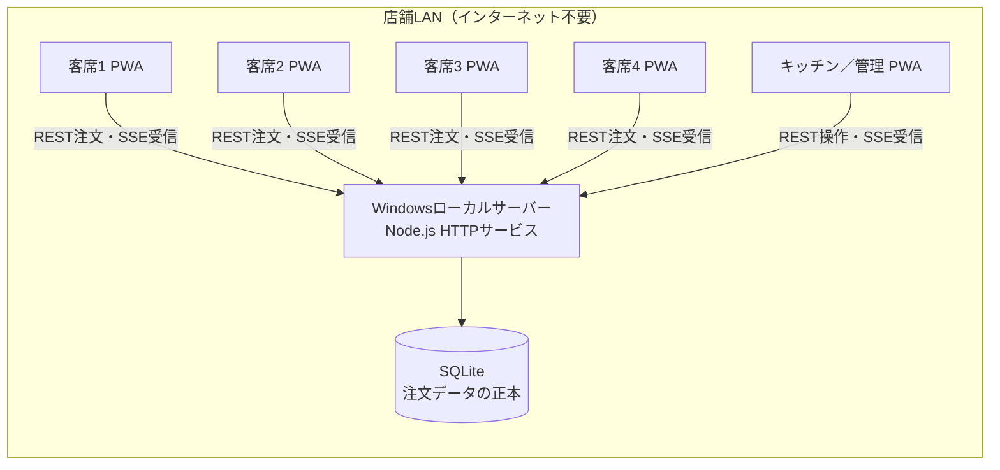

# 段階1：基盤設計

最終更新: 2026-08-09
対象: 小規模ワンオペ居酒屋、客席タブレット4台＋キッチンタブレット1台＋ローカルサーバー1台

## 1. 決定事項

| 項目 | 標準案 |
|---|---|
| サーバー | 客席・キッチン端末とは別の常時稼働Windows PC。試験は既存PC、本運用は専用小型PCを推奨 |
| クライアント | 既存React試作を発展させたブラウザ／PWA |
| 通信 | 通常操作はREST、サーバーからのリアルタイム通知はSSE |
| データベース | サーバーPC上のSQLite。サーバーDBだけを注文データの正本とする |
| ネットワーク | 既存店舗LAN内のみ。サーバーはDHCP予約または固定IPを使用し、インターネットなしでも動作 |
| 端末認証 | 一回限りのペアリングコードと、サーバー発行のランダムな端末トークン |
| テーブル決定 | 認証済み端末とサーバー側割り当てから決定。注文リクエストにテーブル番号を含めない |
| 重複防止 | クライアント生成UUID、正規化した注文内容のSHA-256 fingerprint、SQLite UNIQUE制約 |
| オフライン | 段階2で客席送信待ちをIndexedDBへ保存。`localStorage`は本番注文の正本にしない |

特定のNode.jsフレームワーク、SQLiteドライバー、SSEライブラリ、バージョンは本段階では固定しない。`schema-v1.sql` と `openapi-v1.yaml` を満たす実装を選ぶ。

## 2. システム構成



### 役割

- **客席4台**: 固定テーブルのメニュー表示、注文作成、注文送信、スタッフ呼び出し。価格・合計は表示せず、管理操作は許可しない。
- **キッチン1台**: 新着・提供状態・履歴・スタッフ呼び出しを扱う。信頼されたスタッフ端末として、管理画面を使う場合は `admin` 権限でペアリングする。
- **ローカルサーバー1台**: 認証、テーブル割り当て、価格・売り切れ検証、注文トランザクション、SQLite、イベント履歴、SSE配信、バックアップを担う。Androidタブレットはサーバーを兼用しない。

サーバーはWindowsサービスとして自動起動する実装を段階2以降で用意する。ルーターではIPをDHCP予約し、UPnPとインターネット側ポート転送を無効にする。ファイアウォールは店舗のプライベートサブネットから対象ポートへの接続だけを許可する。

本運用は、ローカルCAで発行した証明書を各管理対象タブレットへ導入し、予約IPをSubject Alternative Nameに含むHTTPSを標準とする。試験中にHTTPを使う場合は、隔離された店舗LANと架空データに限定し、盗聴・トークン漏えいの残余リスクを受け入れた試験モードとして明示する。有料証明書やクラウドは不要である。

## 3. データの正本とクライアント保持範囲

SQLiteにコミットされたデータだけを、注文、注文品目、提供状態、メニュー、売り切れ、端末割り当て、スタッフ呼び出しの正本とする。SSE、クライアントキャッシュ、画面表示はDBから派生する投影であり、正本ではない。

クライアントが保持してよい情報は次に限定する。

- `deviceId`、サーバーURL、端末トークン、端末設定のキャッシュ
- メニューとアクティブ注文の読み取りキャッシュ、および取得時のeventId
- 最後に受信・適用した `(eventEpoch, eventId)` の組
- UI設定、画面遷移、未確定のカート
- 段階2で実装する、送信前の注文と同じ `clientOrderId` を持つIndexedDB送信待ち

キャッシュ上の価格、売り切れ、テーブル番号、提供状態を最終判断に使わない。注文受付時の価格・売り切れ・端末割り当ては必ずサーバーがトランザクション内で再検証する。端末トークンはソースコード、Git、ログへ書かず、ブラウザの端末専用ストレージへ保存する。XSS対策を前提とし、端末紛失時はサーバーから失効させる。

## 4. LAN内通信と障害時の動作

### 通常時

1. クライアントはRESTで状態を取得・更新する。
2. サーバーは更新をSQLiteトランザクションで確定し、同じトランザクションで `event_log` を追加する。
3. DBコミット成功後にだけ、該当権限のSSE接続へイベントを送る。
4. クライアントはイベントを受けたらローカル表示へ反映し、必要ならRESTで最新スナップショットを再取得する。

### サーバー停止・Wi-Fi切断・応答消失

- 客席は2xx応答を受けるまで注文成功と表示しない。タイムアウトや応答消失は「結果不明」とし、段階2のIndexedDB送信待ちへ残して**同じclientOrderId**で再送する。新しいIDを生成しない。
- 段階2未実装の間は送信できないことを明示し、紙・口頭注文へ切り替える。現在の `localStorage` 疑似再送を本番保証として使わない。
- キッチンは最後に取得した画面を「オフライン・更新停止」と明示して読み取り専用表示し、提供チェックなどの変更操作を無効にする。復旧後にスナップショットを再取得する。
- SSE切断だけでは、RESTで受理済みの注文を失敗扱いにしない。SSEとRESTは独立して再接続する。
- REST再試行は指数バックオフと小さなランダム揺らぎを使う。`503 server_busy` または `Retry-After` がある場合は従う。
- サーバー再起動時はDBを開き、PRAGMAを設定し、最低限の整合性確認後にready状態へ移る。Windowsサービスは自動再起動し、クライアントはhealth確認とSSE再接続を継続する。

## 5. SQLite設定方針

各DB接続で次を設定する。

```sql
PRAGMA journal_mode = WAL;
PRAGMA foreign_keys = ON;
PRAGMA busy_timeout = 5000;
PRAGMA synchronous = FULL;
```

- **WAL**: 読み取りと短い書き込みを共存させる。DBはネットワーク共有ではなくサーバーPCのローカルディスクへ置く。
- **foreign keys**: 接続ごとに有効化し、起動時とバックアップ検証時に `PRAGMA foreign_key_check` を実行する。
- **busy timeout**: 5秒を標準とする。それでも取得できない場合はロールバックし、APIは `503 server_busy` を返す。
- **durability**: 注文欠落を避けるため `synchronous=FULL` を標準とする。性能変更は実測後に別判断とし、勝手に `NORMAL` へ下げない。
- **transactions**: 書き込みは短い `BEGIN IMMEDIATE` トランザクションに直列化する。外部通信、SSE送信、重いJSON生成をトランザクション内で行わない。
- **order transaction**: 端末認証・割り当て、冪等性、商品・売り切れ、価格、注文・明細、event_logを一つのトランザクションで処理する。
- **checkpoint**: WALチェックポイントは接続数と負荷を計測して定期実行する。バックアップ前に長時間の書き込みを避ける。
- **日時**: 全テーブルでUTC Unix epoch millisecondsをINTEGERで保存する。表示時だけ端末の店舗タイムゾーンへ変換する。
- **金額**: すべてINTEGER円。浮動小数点を使わず、合計はサーバーがスナップショット単価×数量から計算する。

### バックアップと復元

- 稼働中の単純なDBファイルコピーは禁止する。SQLite Online Backup APIまたは同等の整合スナップショット機能を使用する。
- 日次バックアップを別のローカルディスクまたは暗号化USBへ保存し、日次7世代・週次4世代を基本とする。バックアップ先が同一物理ディスクだけの場合は障害対策にならない。
- バックアップにはスキーマバージョン、作成時刻、ファイルハッシュを記録する。作成後に `integrity_check` と `foreign_key_check` を別接続で検証する。
- 復元時はサービスを停止し、現DBを退避してからバックアップを復元する。整合性検査と件数確認後、`system_state.event_epoch` を新しいUUIDへ更新してからサービスを起動する。全クライアントはepoch不一致を検出してsnapshotを取り直す。復元手順は本番導入前に実地試験する。

## 6. RESTとSSEの役割分担

RESTは、現在状態の取得と、結果確認が必要なすべての更新に使う。注文送信、提供チェック、メニュー変更、売り切れ、割り当て、スタッフ呼び出しはRESTの応答で成功・失敗を確定する。

SSEは、注文作成・提供状態・売り切れ・メニュー・割り当て・スタッフ呼び出しの変更通知に使う。SSEをコマンド送信、成功確認、正本保存には使わない。

各イベントはDB世代を表すeventEpochと、`event_log.event_id` によるepoch内で単調増加するeventIdを持つ。SSE形式は次とする。

```text
id: 1842
event: order.created
data: {"eventEpoch":"00000000-0000-4000-8000-000000000100","eventId":1842,"type":"order.created","aggregateId":"...","occurredAtMs":1786280000000,"payload":{...}}
```

- クライアントは最後に**適用した** `(eventEpoch, eventId)` を保持する。
- 再接続時はeventEpochと `Last-Event-ID` または `afterEventId` を送り、サーバーはepoch一致を確認してから次のeventId以降を順番に再送し、ライブ配信へ移る。
- JSON再取得用の `/v1/events/replay` も同じeventId境界を使う。
- epoch不一致、保持期間より古いeventId、現在の最大値より大きいeventIdを検出した場合、サーバーは `event_history_unavailable` を返す。クライアントは `/v1/snapshot` で権限別の最新状態と新しいeventEpoch・lastEventIdを取得し直す。
- SSE送信前にプロセスが停止しても、コミット済みevent_logは再接続で再送できる。遅延・重複イベントを許容し、クライアントはeventIdで二重適用を防ぐ。
- customer接続には自端末・自テーブルに必要なイベントと公開メニュー状態だけを配信する。kitchen/admin接続には業務上必要な店舗全体イベントを配信する。
- ブラウザからのSSEは、Bearer tokenをURLへ露出させずAuthorizationヘッダーを送れるfetchストリームで受信する。native EventSourceやquery文字列へ端末トークンを渡さない。

## 7. 端末登録・ペアリングと権限

### 初回と通常ペアリング

1. サーバー初回起動時に、最初のadmin用ワンタイムコードをローカルコンソールへ一度だけ表示する。有効期限は30分。
2. adminは管理APIで、役割と客席テーブルを指定した8文字以上のランダムなペアリングコードを発行する。通常コードは10分で失効し、一回だけ使用できる。
3. 端末はクライアント生成UUIDの `deviceId`、コード、表示名、appVersionを `/v1/pairings/claim` へ送る。
4. サーバーはコードをトランザクション内で消費し、端末と客席割り当てを作成して、256-bit以上のランダムな端末トークンを一度だけ返す。
5. サーバーDBにはコードとトークンの平文を保存しない。ペアリングコードはサーバー専用秘密値によるHMAC-SHA-256、256-bit端末トークンはSHA-256のハッシュだけを保存する。以後は `Authorization: Bearer <token>` を使用する。

ペアリングclaimは送信元ごとに10分間5回を標準としてレート制限し、連続失敗を監査ログへ残す。サーバー専用秘密値はGitやDBへ入れず、Windowsのアクセス制限された設定領域へ保存し、DBバックアップとは別に復旧手順を用意する。

客席コードは発行時にtableIdへ結び付ける。同じテーブルまたは同じ端末を複数へ割り当てる操作はUNIQUE制約とサービストランザクションで拒否する。割り当て変更は新規注文から適用し、既存・送信待ち・履歴注文の `table_number_snapshot` は変更しない。

注文リクエストにはテーブル番号を持たせない。サーバーは認証トークン→deviceId→有効な端末→サーバー側table assignmentの順で決定する。`deviceId` は検索キーであり認証情報ではない。仮にクライアントがテーブル番号を申告しても無視し、不一致は監査イベントとして拒否する。

### 権限

| role | 許可 |
|---|---|
| `customer` | 自端末設定、客席用メニュー、自端末の注文作成・結果確認、スタッフ呼び出し |
| `kitchen` | アクティブ注文・履歴閲覧、提供状態更新、スタッフ呼び出し解決 |
| `admin` | kitchen権限に加え、メニュー、売り切れ、端末、テーブル割り当て、ペアリング管理 |

客席トークンで他テーブルの注文・履歴、価格、管理APIへアクセスできない。失効端末は403とし、トークンはログへ出さない。LAN内であっても全APIで認証とサーバー側権限検査を行う。healthとペアリングclaimだけを例外とする。

## 8. 注文重複防止の契約

### clientOrderIdとfingerprint

1. 客席端末は注文確定時にUUID v4形式の `clientOrderId` を一度だけ生成する。
2. 段階2では送信前に注文をIndexedDBへ保存する。
3. タイムアウト、再起動、再接続後の再送でも同じ `clientOrderId` を使用する。
4. クライアントはfingerprintやdeviceIdを注文bodyへ含めない。認証済みprincipalのdeviceIdだけをサーバーが使用する。
5. サーバーは同じmenuItemIdが重複していないことを検証し、menuItemIdのASCII昇順に安定ソートする。
6. 次の固定キー順・空白なしUTF-8 JSONをfingerprint入力とする。

```json
{"fingerprintVersion":1,"authenticatedDeviceId":"<device UUID>","items":[{"menuItemId":"<id>","quantity":1}]}
```

7. サーバーは上記UTF-8バイト列のSHA-256を小文字64桁hexで計算する。価格、商品名、厨房通称、テーブル番号、売り切れ、作成時刻、eventId、自動生成IDは含めない。
8. fingerprintはDB内部の監査・競合判定にだけ保存し、customer向けレスポンスへ含めない。再送時もサーバーが同じ方法で再計算する。

### サーバー処理

1. 端末トークンからprincipalを認証し、customer roleを確認する。注文bodyのdeviceId、role、tableIdは使用しない。
2. `BEGIN IMMEDIATE` を開始し、`client_order_id` を検索する。
3. 登録済みで保存済みfingerprintと認証済みdeviceIdが同じなら、既存注文の成功レスポンスを `replayed` として返す。明細とイベントを追加せず、現在の価格・売り切れ・割り当てを再評価しない。
4. 登録済みでfingerprintが異なるなら、既存注文を変更せず409 `idempotency_conflict` を返す。
5. 未登録ならサーバー側割り当てを読み、商品、販売中、売り切れ、数量を検証する。
6. 現在の正式品名、厨房通称、整数円単価、テーブル番号をスナップショットし、合計をサーバー計算する。
7. 注文、全明細、`order.created` event_logを同一トランザクションで一括保存し、コミットする。
8. コミット後にSSE通知を送る。応答前に切断しても、同じIDの再送は手順3となり二重登録されない。

`orders.client_order_id` のUNIQUE制約が並行リクエストの最後の防壁となる。UNIQUE競合が起きた処理は既存レコードを読み直し、fingerprint比較へ合流する。注文時点の正式名・単価スナップショットは不変とし、後の価格、品名、売り切れ変更で更新しない。

価格・売り切れは注文トランザクションがロックを取得して検証した時点の値を使う。受付済み注文は以後の変更から独立する。売り切れになった商品を含む未受付注文は422 `item_sold_out`、価格が変わっていても商品が有効ならサーバー現在価格で受け付け、客席へ価格を返さない。注文から参照されたメニューは物理削除せず `is_active=0` で非表示にする。

## 9. バックアップ以外の運用安全策

- healthはプロセス生存とDB readyを分け、DB未接続時に正常を返さない。
- 各レスポンスへ秘密情報を含まないrequestIdを付け、監査ログと対応付ける。
- ログはトークン、ペアリングコード、注文本文の不要な複製をマスクする。
- メニュー・割り当て更新は更新前後の識別子と実行端末をevent_logへ残す。
- Windows PCの時刻同期と店舗タイムゾーン設定を確認する。保存値は常にUTC epoch millisecondsとする。
- DBディレクトリは一般ユーザー共有に置かず、サービスアカウントと管理者だけに書き込みを許可する。
- インターネットへ直接公開せず、リモート保守用のポート開放を行わない。

## 10. 本段階の対象外

- Node.jsサーバー、REST、SSE、Windowsサービスの実装
- SQLiteドライバーやWebフレームワークの選定・追加
- Migrationランナーの実装
- IndexedDBオフラインキューと再送ワーカー
- React、CSS、既存Worker、Sites配信処理の変更
- 実機ペアリング、証明書配布、ルーター設定、負荷試験
- 会計、決済、QRミラーリング、Bluetooth、クラウド同期、有料API

## 11. 次段階の実装順序

1. `schema-v1.sql` を適用する空DB初期化と、生成済み `system_state` の確認、接続ごとのPRAGMA・トランザクションヘルパーを実装する。
2. health、初回admin bootstrap、ペアリングclaim、Bearer認証、role認可を実装する。
3. 端末設定・メニュー・snapshotの読み取りAPIを実装する。
4. 注文作成トランザクションを実装し、同一ID同一内容、同一ID異内容、並行送信を自動テストする。
5. アクティブ注文、注文詳細、提供更新、履歴、スタッフ呼び出しを実装する。
6. event_log追記、replay、SSE、Last-Event-ID、履歴欠落時snapshot復旧を実装する。
7. 管理用メニュー、売り切れ、端末・テーブル割り当てを実装する。
8. クライアント接続層を `localStorage` 直結からAPIへ分離する。UI変更と同じコミットへ混ぜない。
9. IndexedDB送信待ち、同一clientOrderId再送、バックオフ、結果不明状態を実装する。
10. 4客席＋1キッチンで、同時注文、通信断、応答消失、重複送信、価格変更競合、サーバー再起動、バックアップ復元を受け入れ確認する。

次に実装すべき最小作業は、**SQLite初期化モジュールと `schema-v1.sql` 適用テストだけ**である。HTTPサーバーやReact変更を同時に始めない。
